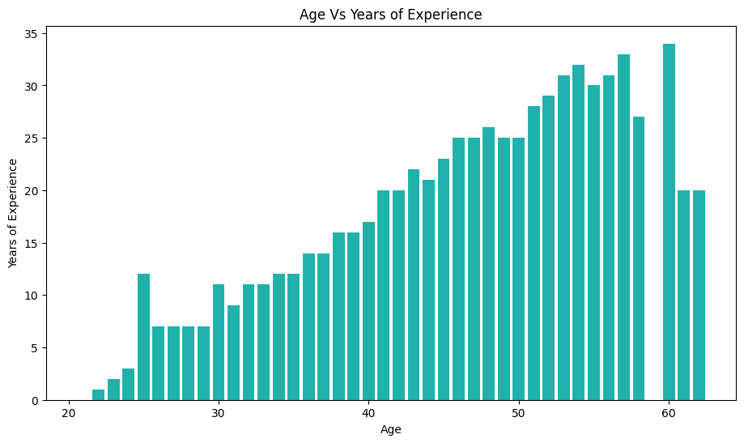
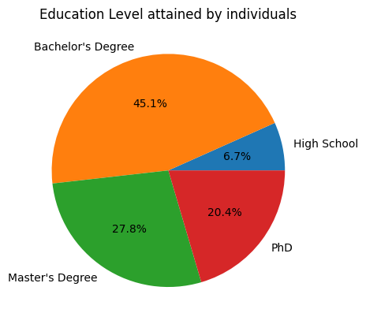

# Salary Data Analysis

## Table of contents
- [Overview](#overview)
    - [Screenshots](#screenshots)
    - [Links](#links)
- [Process](#process)
    - [Tools used](#tools-used)
    - [What I did](#what-i-did)
- [Author](#author)
- [Acknowledgement](#acknowledgement)

## Overview
### Screenshots
Screenshots of some of the visualizations in the project are below;

### Links
- [Github repository](https://github.com/Emmanuel-Afrifa/salary-data-analysis)

## Process
### Tools Used
- Python
- Panda
- Matplotlib
- Numpy

### What I did
I found a salary dataset on [Kaggle](https://www.kaggle.com/datasets/mohithsairamreddy/salary-data) and I employed some data analytics skills to analyze the data in order to get some insight into the data.
The dataset contains information about the gender, age, education level, etc. with over 6000 rows and 6 columns.
There are a lot of charts that depicts the various relationships in the dataset.

## Author
- Emmanuel Afrifa
- [emmaquame9@gmail.com](mailto:emmaquame9@gmail.com)
- [Twitter](https://twitter.com/Emma33712365)
- [Linkedin](https://www.linkedin.com/in/emmanuel-afrifa-840674214/)

## Acknowledgement
- [Kaggle](https://www.kaggle.com/)
